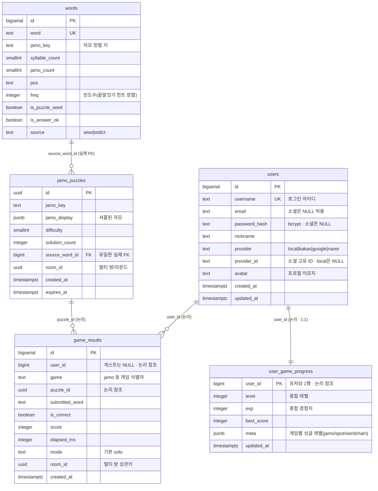

# minigameheaven DB 스키마

계정 + 게임 데이터를 담는 **PostgreSQL 단일 DB**. 멀티플레이 방/실시간 대전 상태는 서버 메모리에만 존재하며 DB에 저장하지 않는다.

- **DB**: PostgreSQL 16
- **적용 방식**: `backend/src/db.js`가 부팅 시 각 모듈의 `schema.sql`을 순서대로 실행(idempotent, `CREATE TABLE IF NOT EXISTS` / `ALTER ... ADD COLUMN IF NOT EXISTS`)
- **소스**: `backend/src/schema.sql`(공유 코어), `backend/src/vowel_game/schema.sql`(사전 + 자모 문제)
- **끝말잇기(word_chain_game)는 전용 테이블이 없다** — 자모 게임의 `words` 사전과 공용 `user_game_progress`를 그대로 재사용하므로 별도 `schema.sql`이 없다(자세한 내용은 아래 각 섹션 참고).

---

## 목차

1. [ERD 개요](#erd-개요)
2. [users](#users--계정)
3. [game_results](#game_results--플레이-기록)
4. [user_game_progress](#user_game_progress--게임별-진행도)
5. [words / jamo_puzzles](#words--jamo_puzzles--사전자모끝말잇기-공용--자모-문제)
6. [설계 메모](#설계-메모)

---

## ERD 개요

> 실선/점선 구분은 Mermaid ER에서 지원하지 않으므로 관계 라벨에 **(실제 FK)** / **(논리)** 를 표기했다. `words`는 자모 조합·끝말잇기 공용 사전이며, 끝말잇기는 전용 테이블 없이 `words` + `user_game_progress.meta`만 재사용한다.

실제 `REFERENCES` 제약이 있는 FK는 **`jamo_puzzles.source_word_id → words.id`뿐**이다. 나머지는 애플리케이션 레벨 참조로만 관리한다 — 게임 모듈 간 결합도를 낮추기 위해 의도적으로 FK를 걸지 않았다(한 모듈이 사라져도 다른 모듈이 영향받지 않도록). `user_game_progress`는 유저당 1행(PK가 `user_id`)이라 `users`와 1:1 관계다.

---

## `users` — 계정

로컬 회원가입 + 소셜 로그인(카카오/구글/네이버) 통합 계정 테이블.

| 컬럼 | 타입 | 설명 |
| --- | --- | --- |
| `id` | `BIGSERIAL PK` | |
| `username` | `TEXT UNIQUE NOT NULL` | 로그인 아이디. 소셜 신규 가입 시 `"<provider>_<providerId>"`로 자동 생성 |
| `email` | `TEXT` | 소셜 로그인은 이메일 동의항목이 없을 수 있어 NULL 허용 |
| `password_hash` | `TEXT` | bcrypt(cost 10) 해시. 소셜 계정은 NULL |
| `nickname` | `TEXT NOT NULL` | |
| `avatar` | `TEXT NOT NULL DEFAULT '🙂'` | 프로필 아이콘. 파일 업로드가 아니라 서버 화이트리스트(`backend/src/avatars.js`) 이모지 중 선택 |
| `provider` | `TEXT NOT NULL DEFAULT 'local'` | `local` \| `kakao` \| `google` \| `naver` |
| `provider_id` | `TEXT` | 소셜 플랫폼 고유 ID. local 계정은 NULL |
| `created_at`, `updated_at` | `TIMESTAMPTZ` | |

**인덱스**: `UNIQUE (provider, provider_id)` — local 계정끼리는 `provider_id`가 모두 NULL이라 서로 충돌하지 않는다.

---

## `game_results` — 플레이 기록

모든 게임 공용 플레이 로그(리더보드/통계용).

| 컬럼 | 타입 | 설명 |
| --- | --- | --- |
| `id` | `BIGSERIAL PK` | |
| `user_id` | `BIGINT` | 로그인 전엔 NULL(게스트). `users.id` 논리 참조 |
| `game` | `TEXT NOT NULL` | `"jamo"` 등 게임 식별자 |
| `puzzle_id` | `UUID` | `jamo_puzzles.id` 논리 참조 |
| `submitted_word` | `TEXT` | |
| `is_correct` | `BOOLEAN NOT NULL` | |
| `score` | `INTEGER NOT NULL DEFAULT 0` | |
| `elapsed_ms` | `INTEGER` | |
| `mode` | `TEXT NOT NULL DEFAULT 'solo'` | 멀티플레이 결과 연동용 예비 컬럼(현재는 jamo 싱글 제출만 기록) |
| `room_id` | `UUID` | 멀티플레이 방 상관키(예비). `jamo_puzzles.room_id`와 공유 |
| `created_at` | `TIMESTAMPTZ` | |

**인덱스**: `(game, score DESC)`(리더보드), `(user_id, game)`(유저별 기록 조회)

---

## `user_game_progress` — 게임별 진행도

**유저당 1행**(PK: `user_id` 단일 컬럼). 종합 지표와 게임별 지표를 함께 담는다.

| 컬럼 | 타입 | 설명 |
| --- | --- | --- |
| `user_id` | `BIGINT PK` | |
| `level` | `INTEGER NOT NULL DEFAULT 1` | **싱글+멀티 종합** 레벨(향후 확장용, 현재 게임별 레벨과 무관) |
| `exp` | `INTEGER NOT NULL DEFAULT 0` | 종합 경험치. jamo `/submit` 정답 시 점수만큼 누적 |
| `best_score` | `INTEGER NOT NULL DEFAULT 0` | 유저 단위 최고 점수(프로필 통계용). 게임 구분 없이 `GREATEST`로 갱신 |
| `meta` | `JSONB NOT NULL DEFAULT '{}'` | **게임별** 싱글모드 진행도. `{"jamo": {"level": N}, "spot": {"level": M}, "wordchain": {"level": K}}` |
| `updated_at` | `TIMESTAMPTZ` | |

**`meta[game].level`의 의미**: 해당 게임에서 **깬 레벨 수**(0 기준). `0`이면 아직 아무 것도 못 깨서 레벨 1만 플레이 가능. 레벨 `n`을 클리어하면 값이 `n`이 되어 레벨 `n+1`이 열린다. 새 유저 생성 시 `initUserProgress()`가 등록된 모든 싱글 게임(`backend/src/progress/api.js`의 `SOLO_GAMES = ["jamo", "spot", "wordchain"]`)에 대해 이 값을 `0`으로 초기화한다. **끝말잇기(`wordchain`)도 전용 테이블 없이 이 `meta` 키 하나만으로 진행도를 관리한다.**

> **왜 `(user_id, game)` 복합키가 아니라 `user_id` 단일키인가**: `level`/`exp`가 "유저 단위 종합 경험치"라는 개념과, 과거처럼 게임마다 행을 나눠 `level` 컬럼을 따로 갖는 구조는 모순이었다. 그래서 유저당 1행으로 통합하고, 게임별로 갈라져야 하는 값(싱글 레벨)만 `meta` JSONB로 분리했다. 자세한 배경은 커밋 히스토리의 "유저 싱글모드 진행도 저장 db 구조 개선" 참고.

---

## `words` / `jamo_puzzles` — 사전(자모·끝말잇기 공용) / 자모 문제

### `words` — 사전 (자모 조합 + 끝말잇기 공용)

`vowel_game/schema.sql`에 정의돼 있지만 **자음 모음 조합(jamo)과 끝말잇기(wordchain) 두 게임이 함께 쓰는 사전**이다. 끝말잇기는 이 테이블에 전용 컬럼을 추가하지 않고 기존 컬럼만 재사용한다(아래 "끝말잇기 용도" 열 참고).

| 컬럼 | 타입 | 설명 | 끝말잇기 용도 |
| --- | --- | --- | --- |
| `id` | `BIGSERIAL PK` | | |
| `word` | `TEXT UNIQUE NOT NULL` | | 단어 존재 검증(`/check`), 첫 글자 집계(`substring`)·글자 수(`char_length`)로 보스 턴 판정 |
| `jamo_key` | `TEXT NOT NULL` | 자모 정렬 키 — 애너그램(자모 조합) 매칭용 | 미사용(자모 전용) |
| `syllable_count`, `jamo_count` | `SMALLINT NOT NULL` | | 미사용(자모 전용) |
| `pos` | `TEXT` | 품사 | |
| `freq` | `INTEGER NOT NULL DEFAULT 0` | 빈도수 | 힌트(`/hint`) 정렬 — 자주 쓰는 단어 우선 노출 |
| `is_puzzle_seed` | `BOOLEAN NOT NULL DEFAULT TRUE` | 출제 후보로 쓸지 | 시작 단어(`/start`) 선정에 자모와 동일 시드 풀 재사용 |
| `is_answer_ok` | `BOOLEAN NOT NULL DEFAULT TRUE` | 정답으로 인정할지 | 체인 검증·힌트에서 정답 인정 필터로 사용 |
| `source` | `TEXT NOT NULL DEFAULT 'seed'` | `seed` \| `stdict`(표준국어대사전 API 캐시) | 끝말잇기 조회로도 stdict 캐시가 추가됨(`is_puzzle_seed=FALSE, is_answer_ok=TRUE`) |

**인덱스**: `jamo_key`, `(syllable_count, freq) WHERE is_puzzle_seed`(출제 후보 선정용 partial index)

> 끝말잇기는 매 턴 `count(*)` 대신 **첫 글자별 단어 수를 서버 기동 후 1회만 집계해 메모리 캐시**한다(`word_chain_game/api.js`의 `loadStartCounts`). DB에 별도 집계 테이블·컬럼을 두지 않는다.

### `jamo_puzzles` — 발급된 문제

정답은 서버만 보관하고 클라이언트에는 셔플된 자모만 내려준다.

| 컬럼 | 타입 | 설명 |
| --- | --- | --- |
| `id` | `UUID PK DEFAULT gen_random_uuid()` | |
| `jamo_key` | `TEXT NOT NULL` | |
| `jamo_display` | `JSONB NOT NULL` | 셔플된 자모 배열 |
| `difficulty` | `SMALLINT NOT NULL DEFAULT 1` | 1~3 |
| `solution_count` | `INTEGER NOT NULL DEFAULT 0` | |
| `source_word_id` | `BIGINT REFERENCES words(id)` | **유일한 실제 FK 제약** |
| `room_id` | `UUID` | 멀티플레이 방/라운드 식별(싱글은 NULL). `game_results.room_id`와 공유 |
| `created_at`, `expires_at` | `TIMESTAMPTZ` | 발급 후 5분 만료 |

**인덱스**: `room_id`

---

## 설계 메모

- **`game` 컬럼은 범용 문자열**(`"jamo"`, `"spot"`, `"wordchain"` 등)이라 새 싱글 게임을 추가할 때 스키마 변경이 필요 없다 — `backend/src/progress/api.js`의 `SOLO_GAMES` 배열에 식별자만 추가하면 된다.
- **끝말잇기(`wordchain`)가 이 설계의 실제 사례**다: 전용 테이블 없이 `SOLO_GAMES`에 식별자 하나 추가(→ `user_game_progress.meta.wordchain`)하고, 자모 게임의 `words` 사전을 그대로 읽어 단어 검증/힌트/시작 단어를 처리한다. 즉 DDL 변경 0으로 게임 하나가 늘었다.
- FK를 의도적으로 최소화한 이유: 게임 모듈 간 독립성 유지(한 게임 테이블을 지워도 다른 모듈 마이그레이션이 깨지지 않도록).
- 스키마 변경은 전부 `CREATE TABLE IF NOT EXISTS` + `ALTER ... ADD COLUMN IF NOT EXISTS` 패턴으로 idempotent하게 작성한다(재부팅마다 재실행되므로). **컬럼 삭제/PK 변경처럼 되돌리기 어려운 변경은 `schema.sql`만으로 표현되지 않으므로 별도 수동 마이그레이션이 필요하다.**

---

_이 문서는 `backend/src/schema.sql` · `backend/src/vowel_game/schema.sql`을 기준으로 작성되었다. 스키마 변경 시 함께 갱신할 것._
